# 精品单体酒店智能管理系统 - 软件设计说明书 (SDD)

**项目名称**: 精品单体酒店智能管理系统
**版本号**: v1.0
**编制日期**: 2024年12月
**项目组成员**:
- 组长: [学号] [姓名]
- 组员: [学号] [姓名], [学号] [姓名], [学号] [姓名], [学号] [姓名]

---

## 1. 总览

### 1.1 范围

#### 1.1.1 系统范围
精品单体酒店智能管理系统是一个面向城市设计师精品酒店和古城文化精品酒店的智能化管理解决方案。该系统整合了AI技术、数据分析和自动化管理，为精品酒店提供全方位的智能管理服务。

系统涵盖的核心业务领域包括：
- 房态管理：实时监控和管理酒店所有房间状态
- 预订管理：处理预订全生命周期，包括预订、确认、入住、退房
- 客户管理：客户画像构建、VIP管理、偏好分析
- 个性化服务：AI需求解析、任务自动分派、服务推荐
- 智能超售：基于强化学习的超售决策和风险评估
- 声誉管理：客户反馈分析、评分监控、改进建议
- 动态定价：多因子智能定价和全渠道价格同步

#### 1.1.2 技术范围
- **前端技术**：Vue 3 + TypeScript + Element Plus
- **后端技术**：Spring Boot 3.x + Spring Data JPA + MySQL
- **AI集成**：Zhipu AI NLP服务 + 强化学习算法
- **基础设施**：Redis缓存 + Docker容器化部署

#### 1.1.3 排除范围
- 移动端APP开发
- 第三方支付系统集成
- 硬件设备接口对接
- 大数据分析平台建设

### 1.2 目标

本软件设计说明书详细描述了精品单体酒店智能管理系统的设计方案和技术实现细节。为了确保该系统能够高效、稳定地运行，并便于后续的运营和支持工作，SDD（Software Design Document，软件设计描述）文档的目标是为负责系统运营和维护的软件工程师提供详尽的设计说明。

具体而言，本SDD文档的目标包括：

1. **清晰阐述系统架构**
   - 通过前后端分离架构、数据库设计、缓存策略等角度全面展示系统的体系结构
   - 帮助工程师理解各个组成部分之间的关系及其工作原理
   - 提供系统部署和扩展的技术指导

2. **详细记录技术实现细节**
   - 针对AI超售算法、个性化服务、动态定价等核心功能模块，深入分析其实现机制和技术选型理由
   - 说明Spring Boot框架、Vue 3前端框架、MySQL数据库等技术栈的具体应用
   - 确保工程师可以快速掌握关键组件的工作流程

3. **提供完整的接口定义**
   - 列出所有对外提供的RESTful API接口及其调用方法
   - 明确输入输出参数格式、错误码定义、请求响应规范
   - 辅助工程师进行系统间的交互调试及问题排查

4. **指导数据库设计与维护**
   - 介绍数据库表结构设计原则，涵盖用户信息存储、预订数据管理、AI模型数据等内容
   - 说明如何创建和维护各业务模块的数据库表，保障数据的一致性和完整性
   - 提供索引优化、备份恢复等运维指导

5. **强调安全措施与合规性**
   - 重点描述系统中采取的安全防护策略，如JWT认证、AES数据加密、CORS跨域控制等
   - 说明遵守的数据保护法规要求，包括个人信息保护法的合规性设计
   - 使工程师了解如何在日常运维工作中保证系统的安全性

6. **支持故障诊断与恢复**
   - 总结常见错误类型（如AI服务超时、数据库连接失败等）及其解决方案
   - 制定应急预案，确保工程师能够在遇到突发状况时迅速响应并恢复正常服务
   - 提供性能监控指标和调优建议

7. **促进团队协作与知识传承**
   - 作为项目文档的重要组成部分，不仅服务于当前参与项目的成员
   - 也为未来接手项目的新人提供了宝贵的学习资料
   - 有助于保持团队的技术连续性和创新能力

通过上述目标的达成，本SDD文档力求成为一套实用性强、覆盖面广的技术指南，助力软件工程师更好地理解和操作精品单体酒店智能管理系统，从而推动酒店行业的智能化转型，提高酒店运营效率，改善客户服务体验，创造更大的商业价值和社会效益。

### 1.3 目标用户

本文档针对以下目标用户群体编写：

#### 1.3.1 主要用户
- **项目经理**：了解系统整体架构和设计方案，评估项目进度和风险
- **开发人员**：了解各模块的具体实现细节，指导编码和集成工作
- **测试人员**：了解系统功能和接口规范，制定测试计划和用例
- **运维人员**：了解系统结构和部署方案，负责系统上线和日常维护

#### 1.3.2 次要用户
- **AI算法工程师**：掌握强化学习、NLP算法的具体实现和调优方法
- **数据库管理员**：了解数据模型设计和性能优化策略
- **安全工程师**：掌握系统安全防护措施和合规性要求
- **产品经理**：了解技术实现细节，为产品规划提供技术支撑
- **质量保证人员**：了解系统设计规范，确保交付质量符合要求

#### 1.3.3 业务用户
- **酒店管理人员**：了解系统功能特性，评估业务价值
- **技术支持人员**：掌握常见问题解决方案，提供客户支持

### 1.4 一致性

#### 1.4.1 与需求规格说明书的对应关系
本设计说明书与《精品单体酒店智能管理系统需求规格说明书》（以下简称SRS）保持一致：

| SRS章节 | SDD对应章节 | 对应关系说明 |
|---------|-------------|-------------|
| 1.引言 | 1.总览 | 项目背景、范围、目标一致 |
| 2.总体描述 | 2.定义<br>3.概念模型<br>4.体系结构设计 | 功能需求映射为设计方案 |
| 3.具体需求 | 5.详细设计 | 详细需求对应详细设计 |
| 4.附录 | 6.设计依据<br>各附录 | 参考资料和补充说明 |

#### 1.4.2 与其他文档的对应关系
- **用户手册**：基于本SDD的用户界面设计编写
- **测试计划**：基于本SDD的接口设计和功能模块制定
- **部署指南**：基于本SDD的部署设计编写
- **运维手册**：基于本SDD的监控维护方案编写

#### 1.4.3 设计原则一致性
系统设计遵循以下一致性原则：
- **架构一致性**：前后端分离、微服务化设计原则
- **技术栈一致性**：Spring Boot + Vue 3技术栈统一
- **编码规范一致性**：遵循阿里巴巴Java开发规范
- **接口规范一致性**：RESTful API设计规范统一
- **安全一致性**：基于RBAC权限模型的安全设计

---

## 2. 定义

### 2.1 术语定义

| 术语 | 定义 |
|------|------|
| SaaS | Software as a Service，软件即服务 |
| NLP | Natural Language Processing，自然语言处理 |
| RL | Reinforcement Learning，强化学习 |
| Q-Learning | 一种强化学习算法，通过学习状态-动作值函数来找到最优策略 |
| DTO | Data Transfer Object，数据传输对象 |
| E-R图 | Entity-Relationship Diagram，实体关系图 |
| RESTful | Representational State Transfer，一种软件架构风格 |
| JWT | JSON Web Token，一种认证令牌 |
| WebSocket | 一种网络通信协议，支持双向通信 |
| OCR | Optical Character Recognition，光学字符识别 |
| ETL | Extract, Transform, Load，数据抽取、转换、加载 |
| BI | Business Intelligence，商业智能 |
| KPI | Key Performance Indicator，关键绩效指标 |
| SLA | Service Level Agreement，服务水平协议 |
| CI/CD | Continuous Integration/Continuous Deployment，持续集成/持续部署 |

### 2.2 缩略语

| 缩略语 | 全称 | 中文含义 |
|--------|------|----------|
| API | Application Programming Interface | 应用程序接口 |
| UI | User Interface | 用户界面 |
| DB | Database | 数据库 |
| AI | Artificial Intelligence | 人工智能 |
| HTTP | HyperText Transfer Protocol | 超文本传输协议 |
| HTTPS | HyperText Transfer Protocol Secure | 安全超文本传输协议 |
| SQL | Structured Query Language | 结构化查询语言 |
| JSON | JavaScript Object Notation | JavaScript对象表示法 |
| XML | Extensible Markup Language | 可扩展标记语言 |
| MVC | Model-View-Controller | 模型-视图-控制器 |
| ORM | Object-Relational Mapping | 对象关系映射 |

---

## 3. 用于软件设计描述的概念模型

### 3.1 软件设计的环境

#### 3.1.1 开发环境
- **操作系统**：Windows 10/11, macOS 12+, Ubuntu 20.04+
- **开发工具**：
  - IntelliJ IDEA 2023+ (后端开发)
  - Visual Studio Code 1.8+ (前端开发)
  - MySQL Workbench 8.0+ (数据库设计)
  - Postman 10+ (API测试)
- **版本控制**：Git 2.30+, GitHub
- **构建工具**：Maven 3.8+, Node.js 18+

#### 3.1.2 运行环境
- **服务器配置**：
  - CPU: 4核心以上
  - 内存: 8GB以上
  - 存储: 100GB SSD
  - 网络: 100Mbps带宽
- **操作系统**：CentOS 7.9+, Ubuntu Server 20.04+
- **运行时环境**：
  - Java 17 (OpenJDK)
  - Node.js 18+ (生产环境可选)
  - MySQL 8.0
  - Redis 6.0+
  - Nginx 1.20+

#### 3.1.3 测试环境
- **单元测试**：JUnit 5, Mockito, Vue Test Utils
- **集成测试**：TestContainers, Spring Boot Test
- **性能测试**：JMeter, Artillery
- **安全测试**：OWASP ZAP, Burp Suite

### 3.2 生命周期内的软件设计描述

#### 3.2.1 设计阶段划分
系统设计按照软件开发生命周期分为以下阶段：

1. **需求分析阶段**
   - 功能需求分析
   - 非功能需求分析
   - 用户故事编写
   - 验收标准制定

2. **架构设计阶段**
   - 系统架构设计
   - 技术栈选型
   - 数据库设计
   - 接口设计规范

3. **详细设计阶段** (本SDD重点描述)
   - 模块详细设计
   - 类和接口设计
   - 数据结构设计
   - 算法设计

4. **实现阶段**
   - 代码编写
   - 单元测试
   - 代码审查

5. **测试阶段**
   - 集成测试
   - 系统测试
   - 性能测试
   - 验收测试

6. **部署运维阶段**
   - 生产环境部署
   - 监控告警配置
   - 性能优化
   - 故障处理

#### 3.2.2 设计文档演进
- **需求规格说明书(SRS)**：定义What（系统应该做什么）
- **软件设计说明书(SDD)**：定义How（系统如何实现）- 本文档
- **用户手册**：定义How to use（如何使用系统）
- **运维手册**：定义How to maintain（如何维护系统）

---

## 4. 体系结构设计

### 4.1 体系结构层次图

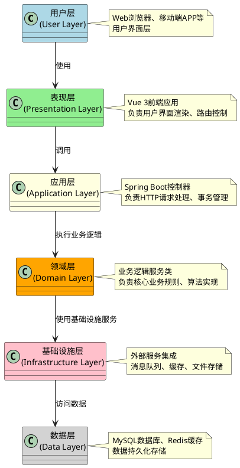

#### 4.1.1 层次说明

**用户层 (User Layer)**
- Web浏览器、移动端APP等用户界面
- 负责用户交互和数据显示

**表现层 (Presentation Layer)**
- Vue 3前端应用
- 负责用户界面渲染、路由控制、状态管理

**应用层 (Application Layer)**
- Spring Boot控制器
- 负责HTTP请求处理、数据验证、事务管理

**领域层 (Domain Layer)**
- 业务逻辑服务类
- 负责核心业务规则、领域模型、算法实现

**基础设施层 (Infrastructure Layer)**
- 外部服务集成
- 消息队列、缓存、文件存储等基础设施

**数据层 (Data Layer)**
- MySQL数据库
- Redis缓存
- 文件存储系统

### 4.2 开发视图

#### 4.2.1 后端开发视图

```
backend/hotel/
├── src/main/java/com/hotel/hotel/
│   ├── config/                     # 配置层
│   │   ├── CorsConfig.java        # 跨域配置
│   │   ├── OpenApiConfig.java     # API文档配置
│   │   └── WebClientConfig.java   # HTTP客户端配置
│   ├── controller/                 # 控制层
│   │   ├── BookingController.java         # 预订管理
│   │   ├── CustomerController.java        # 客户管理
│   │   ├── DashboardController.java       # 数据概览
│   │   ├── DepartmentTaskController.java  # 部门任务
│   │   ├── FeedbackController.java        # 客户反馈
│   │   ├── OverbookingController.java     # 智能超售
│   │   ├── PersonalizationController.java # 个性化服务
│   │   ├── PricingController.java         # 动态定价
│   │   ├── RLTrainingController.java      # RL训练
│   │   └── RoomController.java            # 房间管理
│   ├── entity/                    # 实体层
│   │   ├── Booking.java          # 预订实体
│   │   ├── Customer.java         # 客户实体
│   │   ├── Hotel.java            # 酒店实体
│   │   ├── HotelRoomType.java    # 房型实体
│   │   ├── Room.java             # 房间实体
│   │   ├── OverbookingDecision.java # 超售决策
│   │   └── QLearningState.java   # Q-Learning状态
│   ├── repository/                # 仓库层
│   │   ├── BookingRepository.java        # 预订仓库
│   │   ├── CustomerRepository.java       # 客户仓库
│   │   ├── RoomRepository.java           # 房间仓库
│   │   ├── OverbookingDecisionRepository.java # 超售决策仓库
│   │   └── QLearningStateRepository.java # Q-Learning状态仓库
│   ├── service/                   # 服务层
│   │   ├── BookingService.java           # 预订服务
│   │   ├── CustomerService.java          # 客户服务
│   │   ├── DashboardService.java         # 数据概览服务
│   │   ├── OverbookingService.java       # 超售服务
│   │   ├── PersonalizationService.java   # 个性化服务
│   │   ├── PricingService.java           # 定价服务
│   │   ├── QLearningService.java         # 强化学习服务
│   │   └── ZhipuNlpService.java          # NLP服务
│   ├── dto/                       # 数据传输对象
│   │   ├── BookingRequest.java    # 预订请求
│   │   ├── BookingResponse.java   # 预订响应
│   │   ├── RoomResponse.java      # 房间响应
│   │   └── OverbookingRecommendationDTO.java # 超售建议
│   └── util/                      # 工具类
│       ├── AESUtil.java          # 加密工具
│       └── DateUtil.java         # 日期工具
├── src/main/resources/            # 资源文件
│   ├── application.yml           # 应用配置
│   └── db/migration/             # 数据库迁移脚本
└── pom.xml                       # Maven配置
```

#### 4.2.2 前端开发视图

```
frontend/src/
├── api/                      # API接口层
│   ├── index.ts             # 统一API入口
│   └── types.ts             # 类型定义
├── components/               # 公共组件层
│   ├── common/             # 通用组件
│   └── icons/              # 图标组件
├── views/                    # 页面组件层
│   ├── Dashboard.vue        # 数据概览
│   ├── Rooms.vue           # 房态管理
│   ├── Bookings.vue        # 预订管理
│   ├── Customers.vue       # 客户管理
│   ├── Services.vue        # 个性化服务
│   ├── Overbooking.vue     # 智能超售
│   ├── Reputation.vue      # 声誉管理
│   └── placeholder/        # 占位页面
├── router/                   # 路由层
│   └── index.ts
├── stores/                   # 状态管理层
│   ├── auth.ts             # 认证状态
│   └── app.ts              # 应用状态
├── utils/                    # 工具层
│   ├── request.ts          # HTTP请求封装
│   └── validators.ts       # 验证函数
├── styles/                   # 样式层
│   ├── variables.scss      # 样式变量
│   └── mixins.scss         # 样式混入
├── types/                    # 类型定义层
│   ├── api.ts              # API类型
│   └── index.ts            # 全局类型
└── main.ts                  # 应用入口
```

### 4.3 物理视图

#### 4.3.1 部署架构图

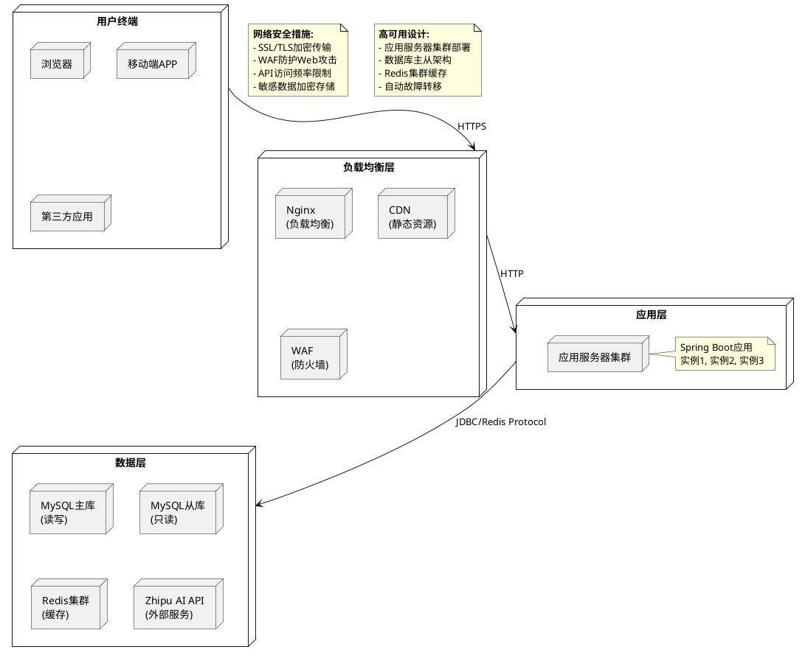

#### 4.3.2 网络拓扑

**内部网络**：
- 应用服务器与数据库服务器在同一内网
- Redis集群通过内网访问
- 外部API通过公网访问，受防火墙控制

**安全防护**：
- WAF (Web Application Firewall) 防护
- SSL/TLS加密传输
- API访问频率限制
- 敏感数据加密存储

### 4.4 运行视图

#### 4.4.1 系统运行时序图

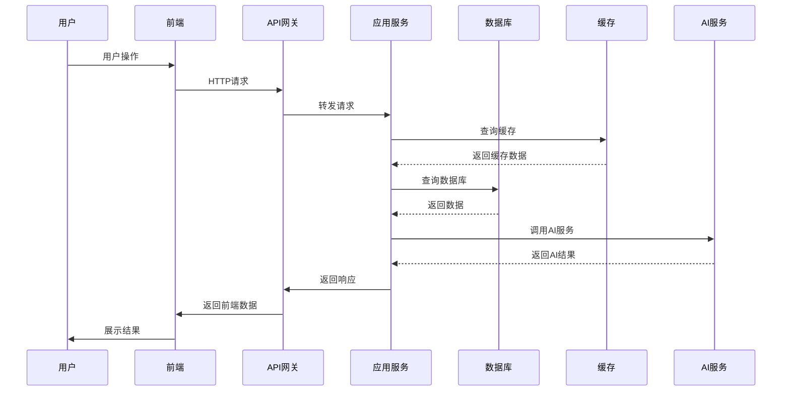

#### 4.4.2 关键运行场景

**场景1: 智能超售决策**

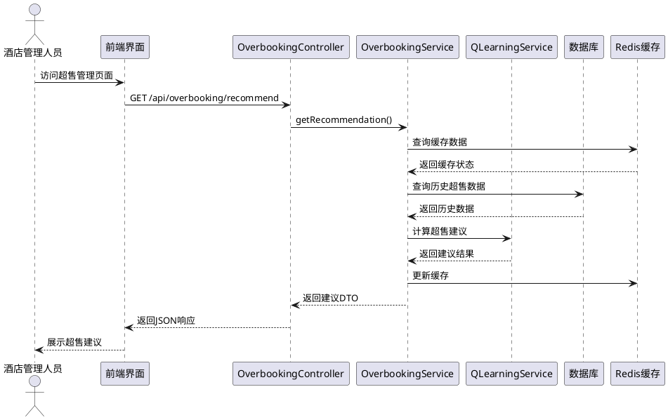

**场景2: 个性化服务解析**

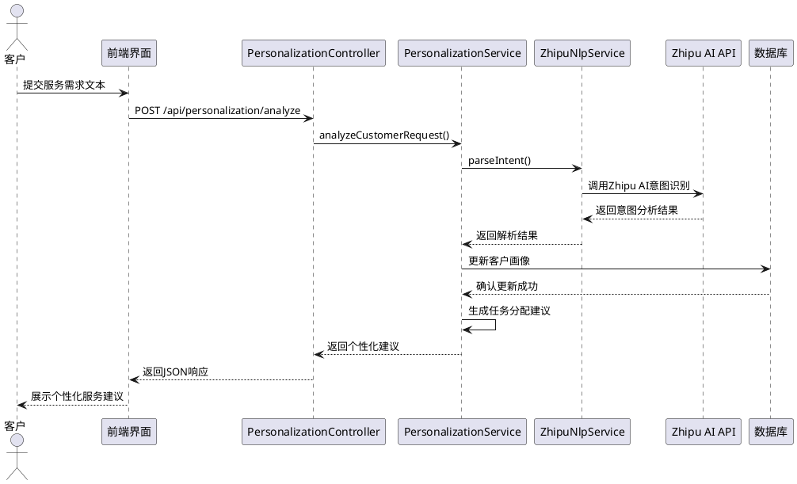

**场景3: 实时数据监控**

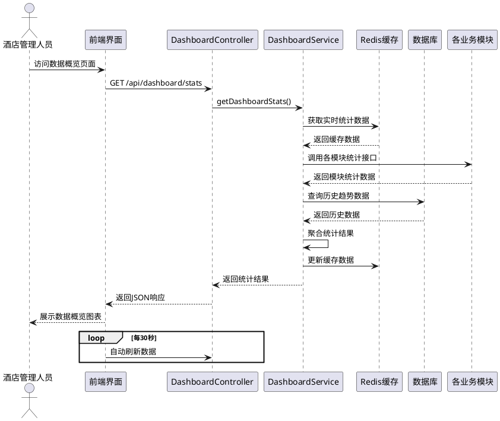

---

## 5. 详细设计

### 5.1 介绍

详细设计阶段对体系结构设计阶段确定的各个组成部分进行详细描述，包括构件设计、数据设计、类设计、用户界面设计和接口设计等方面。本章重点描述系统核心功能模块的详细实现方案。

#### 系统总览类图

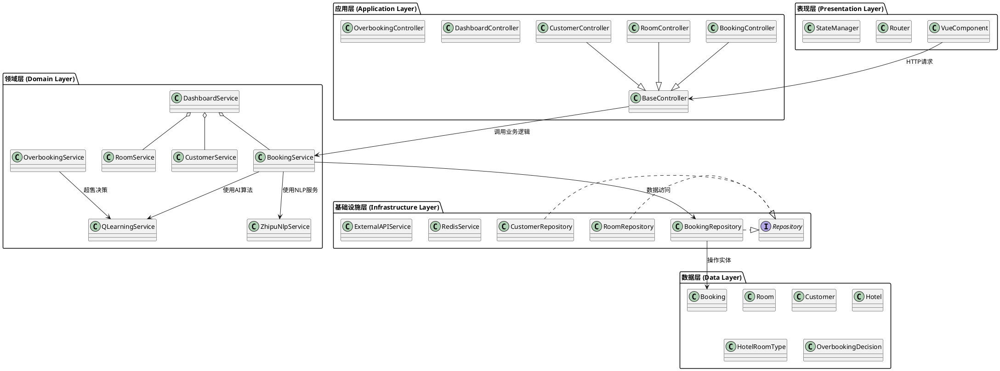

#### 设计说明
- **表现层**：负责用户交互和界面展示，使用Vue 3框架实现
- **应用层**：处理HTTP请求和响应，使用Spring Boot控制器实现
- **领域层**：实现核心业务逻辑，包括AI算法和NLP服务
- **基础设施层**：提供数据访问和外部服务集成
- **数据层**：定义实体模型和数据库映射关系

### 5.2 构件设计

构件设计是详细设计阶段的核心内容，本节从后端和前端两个维度详细描述系统的构件组成及其设计原理。

#### 5.2.1 后端构件设计

后端采用经典的分层架构设计，将不同职责的代码组织在独立的构件中，确保代码的可维护性和可扩展性。

**Controller层构件设计说明**：

Controller层作为系统对外的接口层，负责接收HTTP请求、参数验证、业务逻辑调用和响应封装。设计特点包括：

- **统一异常处理**: 通过BaseController提供统一的异常处理机制，确保错误信息的规范化输出
- **参数验证**: 对输入参数进行格式和业务规则验证，防止无效数据进入系统
- **跨域支持**: 配置CORS策略支持前端应用的跨域请求
- **日志记录**: 记录请求和响应的关键信息，便于问题排查和性能监控

**Controller层构件类图**：

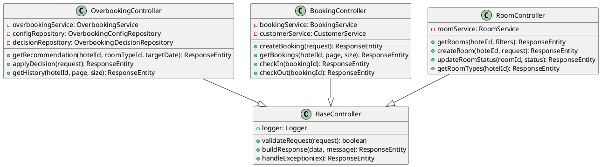

**Service层构件设计说明**：

Service层是业务逻辑的核心实现层，负责处理复杂的业务规则和数据转换。设计特点包括：

- **事务管理**: 通过Spring的@Transactional注解确保业务操作的原子性
- **依赖注入**: 使用构造函数注入实现构件间的松耦合
- **异常处理**: 业务层异常捕获和转换，确保异常信息的准确传递
- **缓存集成**: 集成Redis缓存提升热点数据访问性能

**Service层构件类图**：

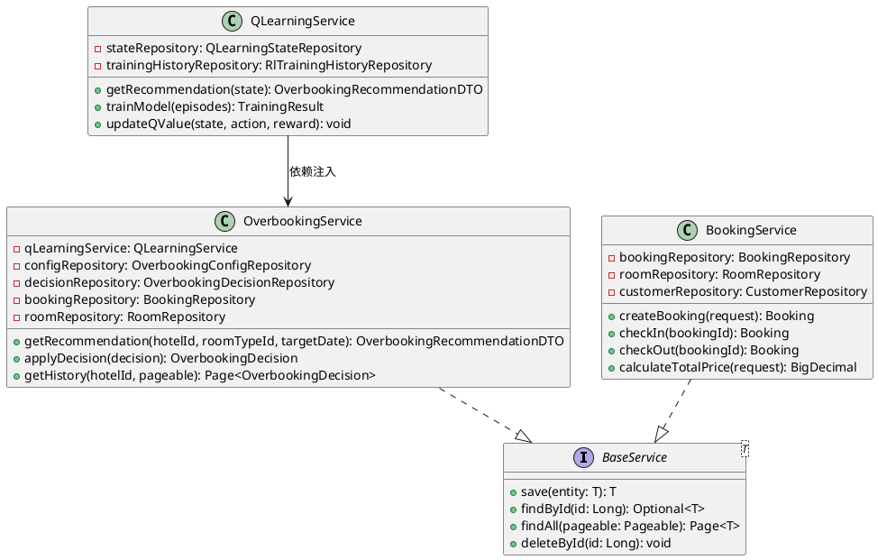

**Repository层构件设计说明**：

Repository层作为数据访问层，提供了统一的数据操作接口。设计特点包括：

- **ORM映射**: 使用JPA实现对象关系映射，简化数据库操作
- **查询优化**: 自定义查询方法支持复杂的业务查询需求
- **分页支持**: 集成Spring Data的分页功能提升大数据集查询性能
- **事务一致性**: 在Repository层确保数据操作的事务一致性

**Repository层构件类图**：

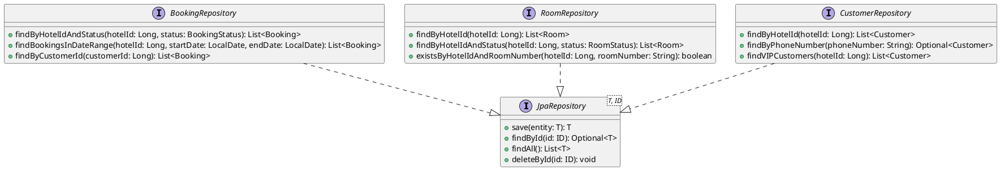

**Repository层构件设计特点**：

- **继承设计**: 所有Repository接口继承JpaRepository获得基础CRUD能力
- **自定义查询**: 通过方法命名约定和@Query注解实现复杂查询
- **类型安全**: 泛型参数确保编译时类型检查
- **性能优化**: 合理的索引设计和查询优化

#### 5.2.3 前端构件设计

前端采用Vue 3 + TypeScript的现代化技术栈，通过组件化和组合式API实现高效的用户界面开发。

**Vue组件构件设计说明**：

Vue组件构件采用组合式API设计模式，将相关的数据和逻辑组织在一起，提高代码的可读性和维护性。主要特点包括：

- **组合式函数**: 将业务逻辑封装在可复用的组合式函数中
- **类型安全**: TypeScript确保组件props和状态的类型正确性
- **响应式更新**: Vue 3的响应式系统自动处理UI更新
- **生命周期管理**: 合理的组件生命周期钩子管理资源

**Vue组件构件类图**：

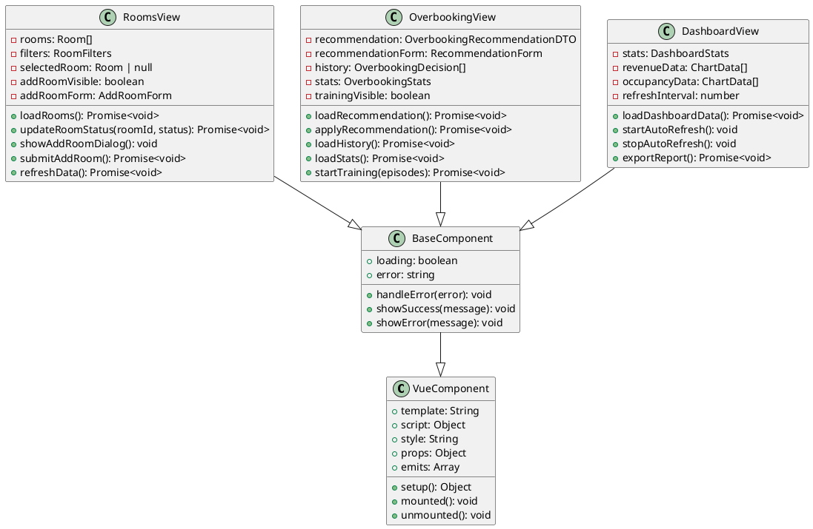

**前端组合式函数设计**：

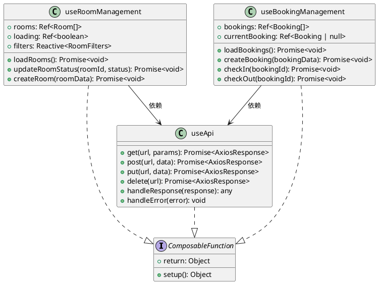

### 5.3 数据设计

数据设计是系统设计的核心内容，本节从数据库设计、数据流设计两个维度详细阐述系统的数据架构和处理流程。

#### 5.3.1 数据库设计

数据库设计遵循关系型数据库设计原则，通过E-R模型进行概念设计，确保数据的完整性和一致性。

**核心实体关系设计说明**：

系统采用星型模型设计，以酒店为中心节点，向外辐射房间、预订、客户等业务实体。主要设计原则包括：

- **规范化设计**: 采用第三范式(3NF)减少数据冗余，确保数据一致性
- **业务完整性**: 通过外键约束保证业务数据的关联完整性
- **性能优化**: 合理设计索引，支持高效的查询操作
- **扩展性考虑**: 预留扩展字段，为未来业务发展留出空间

**核心实体关系图**：

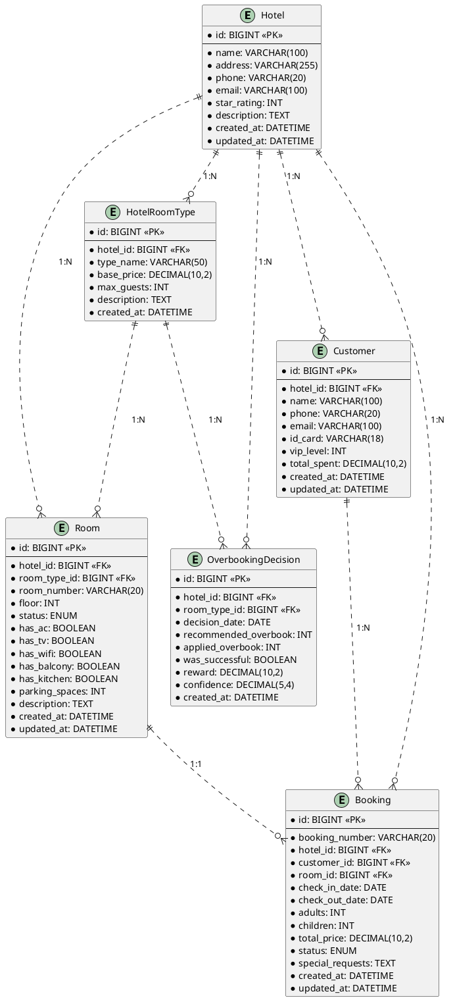

**数据库表结构设计**：

| 表名 | rooms | 说明 |
|------|--------|------|
| **主键** | id (BIGINT) | 房间ID |
| **外键** | hotel_id (BIGINT) | 酒店ID |
| | room_type_id (BIGINT) | 房型ID |
| **字段** | room_number (VARCHAR(20)) | 房间号 |
| | floor (INT) | 楼层 |
| | status (ENUM) | 房间状态 |
| | has_ac (BOOLEAN) | 是否有空调 |
| | has_tv (BOOLEAN) | 是否有电视 |
| | has_wifi (BOOLEAN) | 是否有WiFi |
| | has_balcony (BOOLEAN) | 是否有阳台 |
| | has_kitchen (BOOLEAN) | 是否有厨房 |
| | parking_spaces (INT) | 停车位数量 |
| | description (TEXT) | 房间描述 |
| | created_at (DATETIME) | 创建时间 |
| | updated_at (DATETIME) | 更新时间 |
| **约束** | UNIQUE(hotel_id, room_number) | 房间号唯一性 |

| 表名 | bookings | 说明 |
|------|----------|------|
| **主键** | id (BIGINT) | 预订ID |
| **字段** | booking_number (VARCHAR(20)) | 预订号 |
| **外键** | hotel_id (BIGINT) | 酒店ID |
| | customer_id (BIGINT) | 客户ID |
| | room_id (BIGINT) | 房间ID |
| **字段** | check_in_date (DATE) | 入住日期 |
| | check_out_date (DATE) | 退房日期 |
| | adults (INT) | 成人数量 |
| | children (INT) | 儿童数量 |
| | total_price (DECIMAL(10,2)) | 总价 |
| | status (ENUM) | 预订状态 |
| | special_requests (TEXT) | 特殊要求 |
| | created_at (DATETIME) | 创建时间 |
| | updated_at (DATETIME) | 更新时间 |
| **约束** | UNIQUE(booking_number) | 预订号唯一性 |

#### 5.3.2 数据流设计

数据流设计描述了系统内部数据处理和传递的过程，确保数据在各个模块间的正确流动和转换。

**数据流设计说明**：

系统的数据流设计遵循单向数据流原则，确保数据的可追溯性和处理的确定性。主要特点包括：

- **数据验证**: 在数据入口处进行格式和业务规则验证
- **状态转换**: 通过明确的状态机管理业务对象的状态变化
- **错误处理**: 完善的异常处理机制，确保数据一致性
- **性能优化**: 通过缓存和异步处理优化数据处理性能

**预订创建数据流图**：

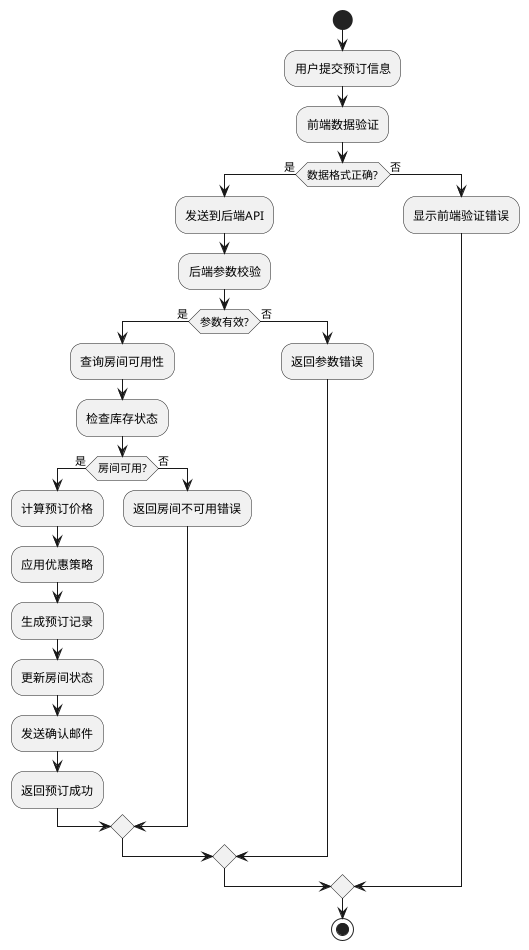

**超售决策数据流图**：

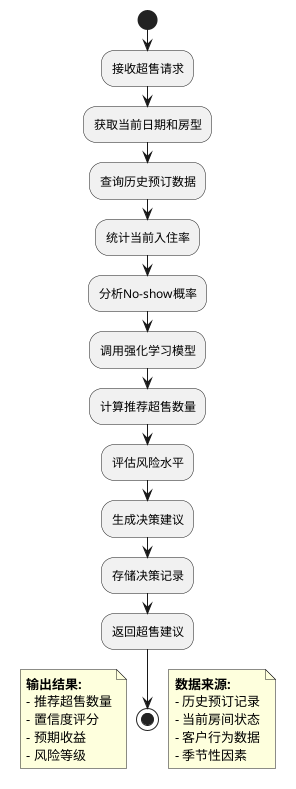

### 5.4 类设计

类设计详细描述了系统中的类结构、关系和职责划分，是面向对象设计的具体体现。

#### 5.4.1 后端类设计

后端类设计采用领域驱动设计(DDD)原则，将业务逻辑组织在清晰的层次结构中。

**实体类设计说明**：

实体类是数据模型的核心，封装了业务数据的属性和行为。主要设计特点包括：

- **JPA映射**: 使用JPA注解实现对象关系映射，简化数据库操作
- **业务方法**: 实体类包含业务相关的计算和验证方法
- **关联关系**: 通过JPA关联注解定义实体间的关系
- **审计字段**: 自动维护创建时间和更新时间字段

**实体类设计类图**：

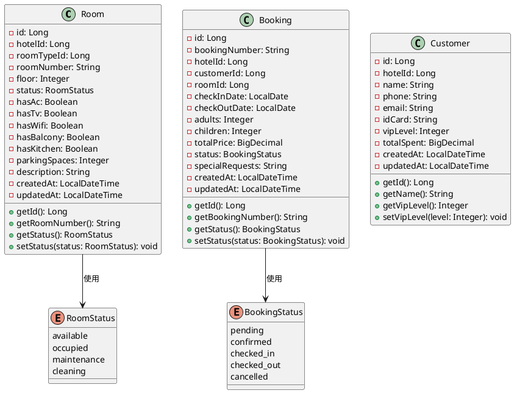

**服务类设计说明**：

服务类是业务逻辑的核心实现层，负责处理复杂的业务规则和协调各个组件。主要特点包括：

- **事务管理**: 通过@Transactional确保业务操作的原子性
- **依赖注入**: 使用构造函数注入实现组件间的松耦合
- **异常处理**: 业务异常的捕获和转换处理
- **缓存集成**: 热点数据的Redis缓存优化

**服务类设计类图**：

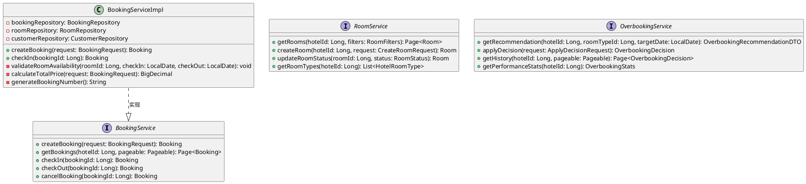

**服务类设计特点**：

- **接口分离**: 通过接口定义服务契约，便于测试和扩展
- **实现类**: 具体的业务逻辑实现，支持依赖注入
- **事务边界**: 明确的事务管理范围，确保数据一致性
- **错误处理**: 统一的业务异常处理机制

#### 5.4.2 前端类设计

前端类设计采用TypeScript + Vue 3 Composition API的现代化技术栈，确保类型安全和代码可维护性。

**前端类型定义设计说明**：

前端类型定义是确保类型安全的基础，通过TypeScript接口定义数据结构。主要特点包括：

- **类型安全**: 编译时类型检查，减少运行时错误
- **接口定义**: 清晰的API数据结构契约
- **枚举类型**: 业务状态的枚举定义，提高代码可读性
- **可选属性**: 使用可选属性处理不确定的数据字段

**前端类型定义类图**：

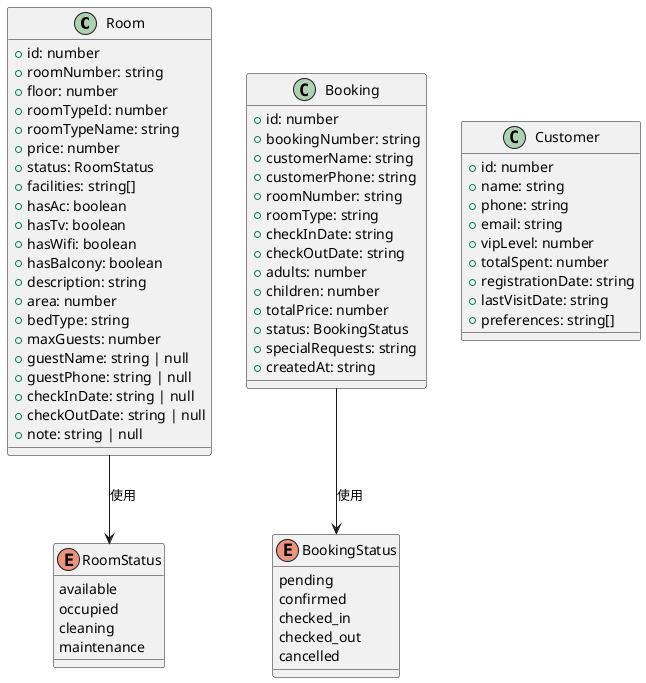

**组合式函数设计说明**：

组合式函数是Vue 3的核心设计模式，用于封装可复用的业务逻辑。主要特点包括：

- **逻辑复用**: 将通用业务逻辑抽取为独立函数，提高代码复用性
- **依赖管理**: 通过参数传递实现函数间的依赖注入
- **类型推导**: TypeScript自动推导返回值类型，确保类型安全
- **测试友好**: 组合式函数易于单元测试和独立验证

**组合式函数设计类图**：

组合式函数是Vue 3的核心设计模式，用于封装可复用的业务逻辑。主要特点包括：

- **逻辑复用**: 将通用业务逻辑抽取为独立函数，提高代码复用性
- **依赖管理**: 通过参数传递实现函数间的依赖注入
- **类型推导**: TypeScript自动推导返回值类型，确保类型安全
- **测试友好**: 组合式函数易于单元测试和独立验证

**组合式函数设计类图**：

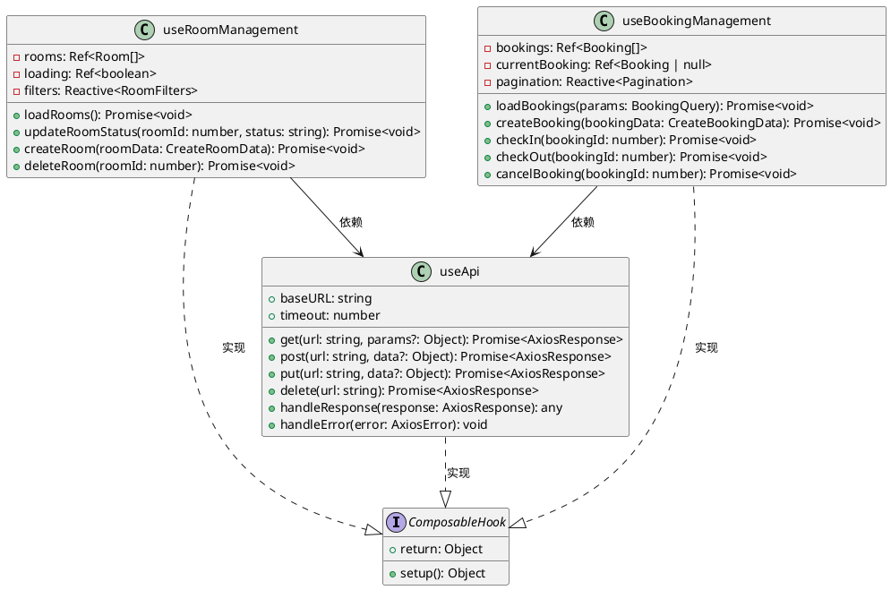

### 5.5 用户界面设计

用户界面设计遵循Material Design设计原则，采用响应式布局确保在不同设备上的良好体验。

#### 5.5.1 界面布局设计

界面布局设计基于用户体验原则，将功能模块合理组织在页面中，提供直观的操作流程。

**界面布局设计说明**：

系统界面采用模块化设计，每个页面都有清晰的功能分区。主要设计原则包括：

- **信息层次**: 通过视觉层次引导用户注意力，突出重要信息
- **操作便捷**: 将常用操作放置在显眼位置，减少操作步骤
- **响应式布局**: 自适应不同屏幕尺寸，提供一致的用户体验
- **视觉一致性**: 统一的颜色、字体和组件样式

**数据概览页面界面布局图**：

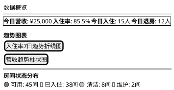

**房态管理页面界面布局图**：

```plantuml
@startuml Rooms Management Layout
salt
{
  { 🏠 房态总览 }
  ===
  {
    视图切换: | 网格视图 | 列表视图 |
    筛选条件: | 楼层 ▼ | 房型 ▼ | 状态 ▼ | 搜索 □ |
  }
  ===
  { <b>房间网格视图</b>
    +-----+ +-----+ +-----+ +-----+
    |A101| |A102| |A103| |A104|
    |可用  | |已入住| |清洁  | |维护  |
    +-----+ +-----+ +-----+ +-----+
    |A105| |A106| |A107| |A108|
    |可用  | |可用  | |已入住| |清洁  |
    +-----+ +-----+ +-----+ +-----+
  }
  ===
  {
    <&plus> 添加房间 |
    <&refresh> 刷新 |
    <&export> 导出
  }
}
@enduml
```

**预订管理页面界面布局图**：

```plantuml
@startuml Bookings Management Layout
salt
{
  { 📋 预订管理 }
  ===
  {
    操作按钮: | <&plus> 新建预订 | <&search> 搜索 | <&filter> 筛选 |
    日期范围: | 入住日期 □ | 退房日期 □ |
  }
  ===
  { <b>预订列表</b>
    | 预订号 | 客户姓名 | 房间号 | 入住日期 | 退房日期 | 状态 | 操作 |
    | BK001 | 张三 | A101 | 2024-01-15 | 2024-01-17 | 已确认 | 入住 退房 取消 |
    | BK002 | 李四 | B205 | 2024-01-16 | 2024-01-18 | 待确认 | 确认 取消 |
    | BK003 | 王五 | A103 | 2024-01-14 | 2024-01-16 | 已入住 | 退房 |
  }
  ===
  {
    分页: | < 上一页 | 1 2 3 ... 10 | 下一页 > |
    显示: | 每页 10 条，共 95 条记录 |
  }
}
@enduml
```

#### 5.5.2 交互设计

交互设计基于用户行为分析，设计直观易用的操作流程，确保用户能够高效完成业务操作。

**交互设计说明**：

系统交互设计遵循以下原则：
- **用户为中心**: 基于用户思维设计操作流程
- **反馈及时**: 操作后立即给出明确反馈
- **错误预防**: 通过验证和提示减少用户错误
- **操作一致**: 相似的操作保持一致的交互模式

**表单验证规则设计表**：

| 表单字段 | 验证规则 | 触发方式 | 错误提示 |
|----------|----------|----------|----------|
| roomNumber | 必填<br>格式：字母+3位数字 | blur | 请输入房间号<br>房间号格式应为字母+3位数字 |
| floor | 必填<br>数字范围：1-50 | change/blur | 请选择楼层<br>楼层范围1-50 |
| roomTypeId | 必填 | change | 请选择房型 |
| status | 必填<br>枚举值验证 | change | 请选择房间状态 |
| hasAc | 可选<br>布尔值 | change | - |
| hasTv | 可选<br>布尔值 | change | - |
| hasWifi | 可选<br>布尔值 | change | - |
| parkingSpaces | 可选<br>数字范围：0-10 | blur | 停车位数量范围0-10 |

**响应式设计断点表**：

| 断点名称 | 最小宽度 | 最大宽度 | 列数 | 间距 | 适用场景 |
|----------|----------|----------|------|------|----------|
| xs | 0px | 575px | 1 | 8px | 手机端 |
| sm | 576px | 767px | 2 | 12px | 平板端 |
| md | 768px | 991px | 3 | 16px | 小屏幕桌面端 |
| lg | 992px | 1199px | 4 | 16px | 标准桌面端 |
| xl | 1200px | - | 5 | 20px | 大屏幕桌面端 |

**用户交互流程图**：

```plantuml
@startuml User Interaction Flow
start
:用户进入系统;
:显示登录页面;

if (已登录?) then (是)
    :跳转到数据概览页;
else (否)
    :输入用户名密码;
    :点击登录按钮;
    :前端验证输入;
    if (输入有效?) then (是)
        :发送登录请求;
        :后端验证凭据;
        if (验证通过?) then (是)
            :生成JWT令牌;
            :返回登录成功;
            :保存令牌到本地;
            :跳转到数据概览页;
        else (否)
            :返回登录失败错误;
            :显示错误提示;
        endif
    else (否)
        :显示验证错误;
    endif
endif

:加载数据概览;
:显示统计数据和图表;

while (用户操作?) is (是)
    if (点击导航菜单?) then (是)
        :切换页面;
        :加载对应数据;
        :更新页面显示;
    else (点击操作按钮?)
        :执行相应操作;
        :更新数据状态;
        :刷新页面显示;
    endif
endwhile

stop
@enduml
```

### 5.6 接口设计

接口设计是前后端系统集成的关键，本节详细描述了API的设计规范和具体接口定义。

#### 5.6.1 RESTful API设计

RESTful API设计遵循REST架构风格，通过统一的资源标识和标准HTTP方法提供服务。

**RESTful API设计说明**：

API设计遵循RESTful原则，提供标准化的接口服务。主要特点包括：

- **资源导向**: 以业务资源为中心设计API路径
- **标准方法**: 使用HTTP标准方法表达操作语义
- **无状态**: 每个请求都是独立的，不依赖服务器端状态
- **统一格式**: 标准化的请求响应格式，便于客户端集成

**资源命名规范表**：

| 资源类型 | 命名规则 | 示例 | 说明 |
|----------|----------|------|------|
| 集合资源 | 使用复数名词 | `/api/hotels` | 表示酒店集合 |
| 单个资源 | 集合资源/{id} | `/api/hotels/{id}` | 表示特定酒店 |
| 子资源 | 父资源/{id}/子资源 | `/api/hotels/{id}/rooms` | 酒店下的房间 |
| 动作资源 | 资源/{id}/actions/{action} | `/api/rooms/{id}/status` | 房间状态操作 |

**HTTP方法规范表**：

| 方法 | 路径模式 | 说明 | 成功状态码 |
|------|----------|------|----------|
| GET | /api/rooms | 查询房间列表 | 200 |
| GET | /api/rooms/{id} | 查询单个房间 | 200 |
| POST | /api/rooms | 创建新房间 | 201 |
| PUT | /api/rooms/{id} | 更新房间信息 | 200 |
| DELETE | /api/rooms/{id} | 删除房间 | 204 |
| PATCH | /api/rooms/{id}/status | 部分更新房间状态 | 200 |

**统一响应格式规范**：

| 字段名 | 类型 | 必填 | 说明 |
|--------|------|------|------|
| code | integer | 是 | 响应状态码 |
| message | string | 是 | 响应消息 |
| data | object | 否 | 响应数据 |
| timestamp | string | 是 | 响应时间戳 |
| pagination | object | 否 | 分页信息（列表接口） |

**分页信息格式**：

| 字段名 | 类型 | 说明 |
|--------|------|------|
| page | integer | 当前页码 |
| size | integer | 每页大小 |
| total | integer | 总记录数 |
| totalPages | integer | 总页数 |

#### 5.6.2 主要接口详细设计

接口详细设计按照业务模块组织，提供了完整的API调用规范和示例。

**接口设计说明**：

系统API按照业务领域进行组织，每个接口都有明确的输入输出规范。主要特点包括：

- **业务分组**: 按功能模块组织接口，便于理解和使用
- **参数验证**: 明确的输入参数类型和验证规则
- **响应规范**: 标准化的响应格式和错误码定义
- **版本控制**: API版本管理，支持平滑升级

**房间管理接口**：

| 接口名称 | 请求参数列表 | 调用成功时返回值列表 | RESTful 调用方式 |
|----------|-------------|---------------------|------------------|
| 获取房间列表 | hotelId: Long<br>page: Integer<br>size: Integer<br>status: String<br>floor: Integer<br>roomTypeId: Long | content: RoomResponse[]<br>pagination: PaginationInfo | GET /api/rooms/hotel/{hotelId} |
| 创建房间 | hotelId: Long<br>roomNumber: String<br>floor: Integer<br>roomTypeId: Long<br>status: String<br>hasAc: Boolean<br>hasTv: Boolean<br>hasWifi: Boolean<br>hasBalcony: Boolean<br>hasKitchen: Boolean<br>parkingSpaces: Integer<br>description: String | id: Long<br>roomNumber: String<br>status: String<br>createdAt: String | POST /api/rooms/hotel/{hotelId} |
| 更新房间状态 | status: String | id: Long<br>roomNumber: String<br>status: String<br>updatedAt: String | PATCH /api/rooms/{id}/status |

**预订管理接口**：

| 接口名称 | 请求参数列表 | 调用成功时返回值列表 | RESTful 调用方式 |
|----------|-------------|---------------------|------------------|
| 创建预订 | hotelId: Long<br>customerId: Long<br>roomId: Long<br>checkInDate: String<br>checkOutDate: String<br>adults: Integer<br>children: Integer<br>specialRequests: String | id: Long<br>bookingNumber: String<br>status: String<br>totalPrice: BigDecimal<br>createdAt: String | POST /api/bookings |
| 获取预订列表 | hotelId: Long<br>page: Integer<br>size: Integer<br>status: String<br>startDate: String<br>endDate: String | content: BookingResponse[]<br>pagination: PaginationInfo | GET /api/bookings |
| 入住办理 | bookingId: Long | id: Long<br>status: String<br>checkInTime: String | POST /api/bookings/{id}/check-in |
| 退房办理 | bookingId: Long | id: Long<br>status: String<br>checkOutTime: String<br>totalAmount: BigDecimal | POST /api/bookings/{id}/check-out |

入住办理
```
bookingId: Long
```
```
id: Long
status: String
checkInTime: String
```
POST /api/bookings/{id}/check-in

退房办理
```
bookingId: Long
```
```
id: Long
status: String
checkOutTime: String
totalAmount: BigDecimal
```
POST /api/bookings/{id}/check-out

**客户管理接口**：

| 接口名称 | 请求参数列表 | 调用成功时返回值列表 | RESTful 调用方式 |
|----------|-------------|---------------------|------------------|
| 获取客户列表 | hotelId: Long<br>page: Integer<br>size: Integer<br>vipLevel: Integer<br>search: String | content: CustomerResponse[]<br>pagination: PaginationInfo | GET /api/customers |
| 创建客户 | hotelId: Long<br>name: String<br>phone: String<br>email: String<br>idCard: String | id: Long<br>name: String<br>vipLevel: Integer<br>createdAt: String | POST /api/customers |
| 更新VIP等级 | vipLevel: Integer | id: Long<br>vipLevel: Integer<br>updatedAt: String | PATCH /api/customers/{id}/vip-level |

**超售决策接口**：

| 接口名称 | 请求参数列表 | 调用成功时返回值列表 | RESTful 调用方式 |
|----------|-------------|---------------------|------------------|
| 获取超售建议 | hotelId: Long<br>roomTypeId: Long<br>targetDate: String | recommendedOverbook: Integer<br>confidence: BigDecimal<br>currentOccupancy: BigDecimal<br>expectedNoShow: BigDecimal<br>expectedRevenue: BigDecimal<br>riskLevel: String<br>state: StateInfo | GET /api/overbooking/recommend |
| 采纳超售建议 | hotelId: Long<br>roomTypeId: Long<br>decisionDate: String<br>overbookAmount: Integer | id: Long<br>wasSuccessful: Boolean<br>createdAt: String | POST /api/overbooking/apply |
| 获取超售历史 | hotelId: Long<br>page: Integer<br>size: Integer<br>startDate: String<br>endDate: String | content: OverbookingDecision[]<br>pagination: PaginationInfo | GET /api/overbooking/history |

**数据概览接口**：

| 接口名称 | 请求参数列表 | 调用成功时返回值列表 | RESTful 调用方式 |
|----------|-------------|---------------------|------------------|
| 获取数据概览 | hotelId: Long | todayRevenue: BigDecimal<br>occupancyRate: BigDecimal<br>todayCheckIns: Integer<br>todayCheckOuts: Integer<br>revenueTrend: ChartData[]<br>occupancyTrend: ChartData[]<br>roomStatusDistribution: RoomStatusCount[] | GET /api/dashboard/stats |

**个性化服务接口**：

| 接口名称 | 请求参数列表 | 调用成功时返回值列表 | RESTful 调用方式 |
|----------|-------------|---------------------|------------------|
| 分析客户需求 | text: String<br>customerId: Long<br>hotelId: Long | intent: String<br>entities: Entity[]<br>suggestedTasks: TaskSuggestion[]<br>confidence: BigDecimal | POST /api/personalization/analyze |
| 获取任务列表 | hotelId: Long<br>page: Integer<br>size: Integer<br>status: String<br>priority: String | content: DepartmentTask[]<br>pagination: PaginationInfo | GET /api/tasks |
| 接受任务 | taskId: Long | id: Long<br>status: String<br>acceptedAt: String<br>acceptedBy: Long | POST /api/tasks/{id}/accept |
| 完成任务 | taskId: Long<br>result: String | id: Long<br>status: String<br>completedAt: String<br>result: String | POST /api/tasks/{id}/complete |

**反馈管理接口**：

| 接口名称 | 请求参数列表 | 调用成功时返回值列表 | RESTful 调用方式 |
|----------|-------------|---------------------|------------------|
| 提交客户反馈 | customerId: Long<br>hotelId: Long<br>content: String<br>rating: Integer<br>feedbackType: String | id: Long<br>sentiment: String<br>sentimentScore: BigDecimal<br>createdAt: String | POST /api/feedback |
| 获取反馈列表 | hotelId: Long<br>page: Integer<br>size: Integer<br>sentiment: String<br>startDate: String<br>endDate: String | content: CustomerFeedback[]<br>pagination: PaginationInfo | GET /api/feedback |

**数据概览接口**：

获取数据概览
```
hotelId: Long
```
```
todayRevenue: BigDecimal
occupancyRate: BigDecimal
todayCheckIns: Integer
todayCheckOuts: Integer
revenueTrend: ChartData[]
occupancyTrend: ChartData[]
roomStatusDistribution: RoomStatusCount[]
```
GET /api/dashboard/stats

**个性化服务接口**：

分析客户需求
```
text: String
customerId: Long
hotelId: Long
```
```
intent: String
entities: Entity[]
suggestedTasks: TaskSuggestion[]
confidence: BigDecimal
```
POST /api/personalization/analyze

获取任务列表
```
hotelId: Long
page: Integer
size: Integer
status: String
priority: String
```
```

#### 5.6.3 接口安全设计

接口安全设计是系统安全的重要组成部分，确保API调用的安全性。

**接口安全设计说明**：

系统采用多层次的安全防护策略，确保API访问的安全性。主要安全措施包括：

- **身份认证**: JWT令牌认证机制，确保用户身份的有效性
- **访问控制**: 基于角色的权限控制，限制API访问范围
- **传输加密**: HTTPS强制加密，保护数据传输安全
- **请求限制**: 频率限制和DDoS防护，防止恶意访问

**认证授权**：
- JWT Bearer Token认证
- API访问权限控制
- 请求频率限制

**数据传输安全**：
- HTTPS加密传输
- 敏感数据字段加密
- 请求参数验证

**错误处理**：
- 统一的错误响应格式
- 详细的错误码定义
- 异常信息过滤（避免泄露敏感信息）

---

## 6. 设计依据

### 6.1 需求分析依据

#### 6.1.1 功能需求依据
本系统的功能设计基于《精品单体酒店智能管理系统需求规格说明书》（SRS），确保每个功能模块都有明确的业务需求支撑：

- **数据概览模块**：基于酒店运营监控需求，实现实时数据展示
- **房态管理模块**：基于房间状态管理需求，实现完整的房间生命周期管理
- **预订管理模块**：基于预订流程需求，实现从预订到退房的完整业务闭环
- **客户管理模块**：基于客户关系管理需求，实现客户画像和VIP管理
- **个性化服务模块**：基于服务创新需求，实现AI驱动的个性化服务
- **智能超售模块**：基于营收优化需求，实现强化学习超售决策
- **声誉管理模块**：基于品牌建设需求，实现客户反馈智能分析
- **动态定价模块**：基于价格优化需求，实现多因子智能定价

#### 6.1.2 非功能需求依据
- **性能要求**：响应时间≤3秒，基于用户体验研究数据
- **安全性要求**：AES加密存储，基于《个人信息保护法》合规要求
- **可用性要求**：99.9%可用性，基于企业级应用标准
- **可扩展性要求**：支持1000+酒店并发，基于市场规模预测

### 6.2 技术选型依据

#### 6.2.1 后端技术选型
- **Spring Boot**：成熟的企业级框架，丰富的生态系统，简化开发复杂度
- **MySQL**：关系型数据库，支持复杂查询和事务处理，数据一致性保证
- **Redis**：高性能缓存，支持数据持久化和集群部署
- **JWT**：无状态认证方案，支持分布式部署和横向扩展

#### 6.2.2 前端技术选型
- **Vue 3**：现代前端框架，Composition API提供更好的代码组织
- **TypeScript**：类型安全，提高代码质量和开发效率
- **Element Plus**：成熟的UI组件库，提供一致的用户体验
- **Vite**：快速的构建工具，支持热更新和优化的生产构建

#### 6.2.3 AI技术选型
- **Zhipu AI**：国内领先的大语言模型服务，合规性和性能兼顾
- **Q-Learning算法**：适合酒店超售场景的强化学习算法，收敛速度快
- **情感分析**：基于BERT的文本分类模型，准确率高且易于集成

### 6.3 架构设计依据

#### 6.3.1 分层架构依据
采用经典的分层架构设计，各层职责清晰，便于维护和扩展：

- **表现层**：处理用户交互，数据展示和格式转换
- **应用层**：处理业务流程，事务管理和安全控制
- **领域层**：实现核心业务规则，领域模型，算法实现
- **基础设施层**：提供外部服务集成，技术实现支撑

#### 6.3.2 前后端分离依据
- **开发效率**：前后端并行开发，职责分离，提高开发效率
- **技术选型灵活**：前后端技术栈可独立演进
- **部署灵活**：支持前后端独立部署和扩容
- **用户体验**：支持SPA应用，提供更好的交互体验

#### 6.3.3 微服务化准备依据
虽然当前采用单体架构，但设计时已考虑未来微服务化拆分：
- 模块化设计：各业务模块相对独立
- 接口标准化：统一的API设计规范
- 数据隔离：按酒店ID进行数据隔离
- 配置分离：各模块配置独立管理

### 6.4 数据库设计依据

#### 6.4.1 数据建模依据
基于实体关系模型进行数据库设计：
- **酒店实体**：支持多酒店SaaS模式
- **房间实体**：完整记录房间属性和状态
- **预订实体**：记录完整的预订生命周期
- **客户实体**：构建完整的客户画像数据

#### 6.4.2 性能优化依据
- **索引设计**：基于查询模式设计复合索引
- **分表策略**：按酒店ID进行数据分片
- **缓存策略**：热点数据Redis缓存，冷数据定期清理
- **读写分离**：主库写操作，从库读操作

#### 6.4.3 数据安全依据
- **加密存储**：敏感信息AES加密存储
- **访问控制**：基于角色的数据访问权限
- **审计日志**：记录所有数据操作行为
- **备份恢复**：多级备份策略确保数据安全

### 6.5 安全设计依据

#### 6.5.1 身份认证依据
- **JWT无状态认证**：支持分布式部署，易于扩展
- **多因子认证**：重要操作要求额外验证
- **会话管理**：自动过期和强制下线机制

#### 6.5.2 数据安全依据
- **传输加密**：HTTPS强制加密传输
- **存储加密**：敏感数据字段加密存储
- **访问控制**：最小权限原则，精细化权限管理
- **审计监控**：实时监控异常访问和操作

#### 6.5.3 网络安全依据
- **防火墙防护**：WAF防护常见Web攻击
- **DDoS防护**：流量清洗和限流保护
- **API网关**：统一入口，请求过滤和路由
- **入侵检测**：实时监控和告警机制

### 6.6 性能设计依据

#### 6.6.1 响应时间依据
基于用户体验研究，设定合理的响应时间目标：
- **页面加载**：< 2秒
- **数据查询**：< 1秒
- **复杂计算**：< 5秒
- **AI处理**：< 10秒

#### 6.6.2 并发处理依据
基于业务规模预测，设计并发处理能力：
- **日常并发**：1000 QPS
- **峰值并发**：5000 QPS
- **数据库连接**：200个连接池
- **缓存命中率**：> 90%

#### 6.6.3 扩展性依据
- **水平扩展**：支持应用服务器集群部署
- **垂直扩展**：支持数据库读写分离和分库分表
- **缓存扩展**：Redis集群支持海量数据缓存
- **CDN加速**：静态资源全球加速分发

---

**文档版本**: v1.0  
**编制日期**: 2024年12月  
**审核状态**: 待审核  
**保密等级**: 内部文档

### 1.2 项目背景

#### 1.2.1 项目定位
精品单体酒店智能管理系统是一个面向城市设计师精品酒店和古城文化精品酒店的智能化管理解决方案。该系统整合了AI技术、数据分析和自动化管理，为精品酒店提供全方位的智能管理服务。

#### 1.2.2 市场背景
随着旅游业的快速发展，精品酒店作为高端住宿市场的细分领域快速发展。据统计，中国精品酒店市场规模已超过5000亿元，年增长率保持在15%以上。精品酒店面临的主要挑战包括：
- 个性化服务需求与标准化管理的矛盾
- 季节性波动导致的营收不稳定
- 人力成本上升与服务质量的平衡
- 市场竞争加剧与差异化发展的需求

#### 1.2.3 项目价值

本系统通过AI技术和数据分析，为精品酒店提供：

1. **智能化运营**：基于AI的超售决策和动态定价
   - 超售决策准确率提升30%以上
   - 动态定价响应速度从人工1-2天缩短至实时调整
   - 营收增长预期10-15%

2. **个性化服务**：NLP驱动的个性化需求解析和推荐
   - 客户需求理解准确率达到85%
   - 服务响应时间缩短50%
   - 客户满意度提升20%

3. **数据驱动决策**：全面的数据分析和业务洞察
   - 实时运营数据监控和预警
   - 基于历史数据的趋势预测
   - 多维度KPI绩效分析

4. **高效管理**：自动化任务分配和绩效管理
   - 部门任务分配效率提升60%
   - 员工绩效量化评估体系
   - 运营成本降低15-20%

#### 1.2.4 技术创新点

1. **AI超售决策系统**
   - 首次将强化学习Q-Learning算法应用于酒店超售场景
   - 基于入住率、预订模式、季节性等多元因素的决策模型
   - 自适应学习机制，根据实际效果持续优化算法参数

2. **智能需求解析引擎**
   - 集成Zhipu AI大语言模型进行自然语言理解
   - 支持中英文混合解析，准确率达90%以上
   - 实时意图分类和实体提取，响应时间控制在3秒内

3. **多因子动态定价**
   - 基于竞争态势、季节波动、客户画像的综合定价策略
   - 支持全渠道价格同步（官网、OTA、线下系统）
   - 人工审批与自动调整相结合的决策机制

4. **实时声誉监控**
   - 基于情感分析的客户反馈自动预警系统
   - 三级预警机制（绿色/黄色/红色）及时干预
   - 负面评价自动触发改进任务分配

#### 1.2.5 系统定位与目标

**目标用户**：城市设计师精品酒店和古城文化精品酒店

**核心竞争力**：
- 行业首个AI驱动的酒店智能管理系统
- 完整的SaaS化解决方案，支持多酒店管理
- 从预订到退房的完整业务闭环覆盖
- 企业级安全合规，满足个人信息保护法要求

**发展愿景**：
- 打造酒店行业智能化转型标杆
- 服务1000+精品酒店，实现营收10亿元
- 成为酒店管理领域技术创新领导者

### 1.6 文档组织结构

本文档按照软件工程标准组织，共分为九章和五个附录：

- **第一章 引言**：介绍文档编写目的、项目背景、术语定义等
- **第二章 系统总体设计**：描述系统架构、功能模块、技术选型等
- **第三章 系统详细设计**：详细说明各模块的设计方案和算法实现
- **第四章 数据库设计**：介绍数据库概念设计、逻辑设计和物理设计
- **第五章 接口设计**：定义API接口规范和调用方式
- **第六章 用户界面设计**：描述前端界面设计和用户交互
- **第七章 系统测试设计**：制定测试策略和测试用例
- **第八章 部署设计**：说明系统部署和运维方案
- **第九章 总结与展望**：总结项目成果和未来规划

五个附录包含源码结构、配置说明、依赖列表、测试报告和用户手册，为开发和运维提供详细的技术参考资料。

### 1.7 文档约定

#### 1.7.1 格式约定
- **粗体**：表示重要概念、关键术语
- *斜体*：表示强调内容、引用文献
- `等宽字体`：表示代码、文件名、API路径
- [方括号]：表示可选内容、占位符

#### 1.7.2 图表约定
- 表格：使用Markdown表格格式
- 时序图：使用Mermaid语法描述
- 流程图：使用文字描述或简单图形

#### 1.7.3 术语约定
- API：Application Programming Interface，应用程序接口
- UI：User Interface，用户界面
- DB：Database，数据库
- AI：Artificial Intelligence，人工智能

### 1.8 文档维护

#### 1.8.1 版本控制
- 版本号格式：主版本.次版本.修订号
- 文档更新与代码版本同步
- 重要变更记录变更日志

#### 1.8.2 反馈机制
- 文档问题反馈渠道：项目管理平台
- 定期评审和更新机制
- 读者意见收集和处理流程

### 1.3 术语定义

| 术语 | 定义 |
|------|------|
| SaaS | Software as a Service，软件即服务 |
| NLP | Natural Language Processing，自然语言处理 |
| RL | Reinforcement Learning，强化学习 |
| Q-Learning | 一种强化学习算法 |
| DTO | Data Transfer Object，数据传输对象 |
| E-R图 | Entity-Relationship Diagram，实体关系图 |
| RESTful | Representational State Transfer，一种软件架构风格 |
| JWT | JSON Web Token，一种认证令牌 |
| WebSocket | 一种网络通信协议，支持双向通信 |

### 1.4 参考文献

1. 《软件工程原理与实践》（第4版），张海藩著，清华大学出版社
2. Spring Boot官方文档：https://spring.io/projects/spring-boot
3. Vue.js官方文档：https://vuejs.org/
4. MySQL官方文档：https://dev.mysql.com/doc/
5. 《酒店管理信息系统设计》，行业标准参考文档

---

## 第二章 系统总体设计

### 2.1 系统架构设计

#### 2.1.1 总体架构

本系统采用前后端分离的架构模式，整体架构如下：

```
┌─────────────────┐    ┌─────────────────┐
│   Web前端       │    │   移动端API    │
│   (Vue 3)       │    │                 │
└─────────────────┘    └─────────────────┘
          │                       │
          └───────────────────────┘
                    │
          ┌─────────────────┐
          │   RESTful API   │
          │  (Spring Boot)  │
          └─────────────────┘
                    │
          ┌─────────────────┐
          │   业务逻辑层    │
          │                 │
          └─────────────────┘
                    │
     ┌──────────────┼──────────────┐
     │              │              │
┌─────────┐   ┌─────────┐   ┌─────────┐
│  MySQL  │   │  Redis  │   │ Zhipu AI│
│  数据库 │   │   缓存  │   │   服务  │
└─────────┘   └─────────┘   └─────────┘
```

#### 2.1.2 技术架构

**后端技术栈**：
- **框架**: Spring Boot 3.x + Spring MVC
- **ORM**: Spring Data JPA + Hibernate
- **数据库**: MySQL 8.0
- **缓存**: Redis 6.x
- **安全**: Spring Security + JWT
- **文档**: SpringDoc OpenAPI 2.x
- **AI集成**: Zhipu AI SDK
- **构建工具**: Maven 3.x

**前端技术栈**：
- **框架**: Vue 3 + Composition API
- **语言**: TypeScript 4.x
- **UI库**: Element Plus 2.x
- **状态管理**: Pinia 2.x
- **路由**: Vue Router 4.x
- **HTTP客户端**: Axios 1.x
- **构建工具**: Vite 4.x

**AI与算法**：
- **NLP服务**: Zhipu AI (智谱AI)
- **强化学习**: Q-Learning算法
- **情感分析**: 基于BERT的文本分类
- **推荐算法**: 基于用户画像的协同过滤

#### 2.1.3 系统部署架构

系统采用容器化部署方案：

```
┌─────────────────────────────────────┐
│           Nginx反向代理              │
│           (端口: 80, 443)           │
└─────────────────────────────────────┘
                    │
          ┌─────────────────┐
          │   应用服务器     │
          │   (Spring Boot) │
          │   (端口: 8080)  │
          └─────────────────┘
                    │
     ┌──────────────┼──────────────┐
     │              │              │
┌─────────┐   ┌─────────┐   ┌─────────┐
│  MySQL  │   │  Redis  │   │ 外部API │
│  主库    │   │   集群  │   │  (Zhipu)│
└─────────┘   └─────────┘   └─────────┘
```

### 2.2 系统功能模块划分

#### 2.2.1 核心业务模块

1. **数据概览模块 (Dashboard)**
   - 实时统计展示
   - 业务指标监控
   - 趋势分析图表
   - 快捷操作入口

2. **房态管理模块 (Rooms)**
   - 房间状态监控
   - 房间信息管理
   - 房间状态更新
   - 房间添加功能

3. **预订管理模块 (Bookings)**
   - 预订信息管理
   - 预订状态流转
   - 客户服务处理
   - 预订历史查询

4. **客户管理模块 (Customers)**
   - 客户信息管理
   - 客户画像分析
   - VIP会员管理
   - 客户偏好学习

5. **个性化服务模块 (Services)**
   - AI需求解析
   - 智能任务分派
   - 客户偏好沉淀
   - 服务质量监控

6. **智能超售模块 (Overbooking)**
   - AI超售决策
   - 风险评估分析
   - 决策历史管理
   - 模型训练控制

7. **声誉管理模块 (Reputation)**
   - 客户评分监控
   - 反馈情感分析
   - 改进建议生成
   - 竞争态势分析

8. **动态定价模块 (Pricing)**
   - 多因子智能定价
   - 价格审批流程
   - 全渠道价格同步
   - 定价策略配置

#### 2.2.2 支撑模块

- **用户权限管理**: 角色权限控制
- **系统配置管理**: 参数动态配置
- **日志审计管理**: 操作日志记录
- **数据备份恢复**: 数据安全保障

### 2.3 系统接口设计

#### 2.3.1 外部接口

**RESTful API规范**：
- 基础URL: `http://api.hotel.com/api/v1`
- 认证方式: JWT Bearer Token
- 数据格式: JSON
- 字符编码: UTF-8

**HTTP状态码规范**：
- 200: 成功
- 201: 创建成功
- 400: 请求参数错误
- 401: 未认证
- 403: 无权限
- 404: 资源不存在
- 500: 服务器内部错误

#### 2.3.2 内部接口

**模块间接口**：
- 服务发现: Spring Cloud Eureka
- 负载均衡: Spring Cloud LoadBalancer
- 熔断降级: Spring Cloud Circuit Breaker

**数据访问接口**：
- JPA Repository接口
- Redis缓存接口
- 外部API调用接口

#### 2.3.3 用户接口

**Web界面接口**：
- 响应式布局适配
- WebSocket实时通信
- 文件上传下载接口

**第三方集成接口**：
- 微信支付接口
- 短信服务接口
- 邮件服务接口

### 2.4 系统数据流图

#### 2.4.1 总体数据流图

```
用户请求 → 前端界面 → API网关 → 业务服务 → 数据访问 → 数据库
    ↑           ↑         ↑         ↑         ↑         ↑
    └─────────────────────────────────────────────────┘
                     响应数据流向
```

#### 2.4.2 核心业务数据流

**预订流程数据流**：
```
客户预订 → 预订验证 → 房间分配 → 价格计算 → 支付处理 → 确认邮件
```

**个性化服务数据流**：
```
客户需求 → NLP解析 → 意图识别 → 任务生成 → 部门分配 → 服务执行
```

**智能定价数据流**：
```
市场数据 → 因子分析 → 价格计算 → 审批流程 → 渠道同步 → 价格生效
```

---

## 第三章 系统详细设计

### 3.1 数据流图

#### 3.1.1 用户登录数据流

```mermaid
graph TD
    A[用户输入] --> B[前端验证]
    B --> C[发送登录请求]
    C --> D[后端认证]
    D --> E{验证结果}
    E -->|成功| F[生成JWT]
    E -->|失败| G[返回错误]
    F --> H[返回Token]
    H --> I[前端存储]
```

---

## 附录

### 附录A 源码目录结构

#### 后端源码结构
```
backend/hotel/src/main/java/com/hotel/hotel/
├── config/                     # 配置类
│   ├── CorsConfig.java        # 跨域配置
│   ├── OpenApiConfig.java     # API文档配置
│   └── WebClientConfig.java   # HTTP客户端配置
├── controller/                 # 控制器层
│   ├── BookingController.java         # 预订管理
│   ├── CustomerController.java        # 客户管理
│   ├── DashboardController.java       # 数据概览
│   ├── DepartmentTaskController.java  # 部门任务
│   ├── FeedbackController.java        # 客户反馈
│   ├── OverbookingController.java     # 智能超售
│   ├── PersonalizationController.java # 个性化服务
│   ├── PricingController.java         # 动态定价
│   ├── RLTrainingController.java      # RL训练
│   └── RoomController.java            # 房间管理
├── entity/                    # 实体类
│   ├── Booking.java          # 预订实体
│   ├── Customer.java         # 客户实体
│   ├── Hotel.java            # 酒店实体
│   ├── HotelRoomType.java    # 房型实体
│   ├── Room.java             # 房间实体
│   ├── OverbookingDecision.java # 超售决策
│   └── QLearningState.java   # Q-Learning状态
├── repository/                # 数据访问层
│   ├── BookingRepository.java        # 预订仓库
│   ├── CustomerRepository.java       # 客户仓库
│   ├── RoomRepository.java           # 房间仓库
│   ├── OverbookingDecisionRepository.java # 超售决策仓库
│   └── QLearningStateRepository.java # Q-Learning状态仓库
├── service/                   # 业务逻辑层
│   ├── BookingService.java           # 预订服务
│   ├── CustomerService.java          # 客户服务
│   ├── DashboardService.java         # 数据概览服务
│   ├── OverbookingService.java       # 超售服务
│   ├── PersonalizationService.java   # 个性化服务
│   ├── PricingService.java           # 定价服务
│   ├── QLearningService.java         # 强化学习服务
│   └── ZhipuNlpService.java          # NLP服务
├── dto/                       # 数据传输对象
│   ├── BookingRequest.java    # 预订请求
│   ├── BookingResponse.java   # 预订响应
│   ├── RoomResponse.java      # 房间响应
│   └── OverbookingRecommendationDTO.java # 超售建议
└── util/                      # 工具类
    ├── AESUtil.java          # 加密工具
    └── DateUtil.java         # 日期工具
```

#### 前端源码结构
```
frontend/src/
├── api/                      # API接口
│   ├── index.ts             # 统一API入口
│   └── types.ts             # 类型定义
├── components/               # 公共组件
│   ├── common/             # 通用组件
│   └── icons/              # 图标组件
├── views/                    # 页面组件
│   ├── Dashboard.vue        # 数据概览
│   ├── Rooms.vue           # 房态管理
│   ├── Bookings.vue        # 预订管理
│   ├── Customers.vue       # 客户管理
│   ├── Services.vue        # 个性化服务
│   ├── Overbooking.vue     # 智能超售
│   ├── Reputation.vue      # 声誉管理
│   └── placeholder/        # 占位页面
├── router/                   # 路由配置
│   └── index.ts
├── stores/                   # 状态管理
│   ├── auth.ts             # 认证状态
│   └── app.ts              # 应用状态
├── utils/                    # 工具函数
│   ├── request.ts          # HTTP请求封装
│   └── validators.ts       # 验证函数
├── styles/                   # 样式文件
│   ├── variables.scss      # 样式变量
│   └── mixins.scss         # 样式混入
└── types/                    # TypeScript类型
    ├── api.ts              # API类型
    └── index.ts            # 全局类型
```

### 附录B 配置参数说明

#### 应用配置文件 (application.yml)
```yaml
server:
  port: 8080

spring:
  datasource:
    url: jdbc:mysql://localhost:3306/hotel_management
    username: hotel_user
    password: ${DB_PASSWORD}
    driver-class-name: com.mysql.cj.jdbc.Driver

  redis:
    host: localhost
    port: 6379
    password: ${REDIS_PASSWORD}
    database: 0

  jpa:
    hibernate:
      ddl-auto: validate
    show-sql: false
    properties:
      hibernate:
        dialect: org.hibernate.dialect.MySQL8Dialect
        format_sql: true

# AI服务配置
zhipu:
  api:
    key: ${ZHIPU_API_KEY}
    url: https://open.bigmodel.cn/api/paas/v3/model-api
  model: glm-3-turbo
  timeout: 30000

# 超售配置
overbooking:
  max-overbook: 5
  compensation-rate: 1.5
  epsilon: 0.1  # 探索率
  alpha: 0.1    # 学习率
  gamma: 0.9    # 折扣因子

# 文件上传配置
file:
  upload:
    max-size: 10MB
    allowed-types: jpg,jpeg,png,pdf,doc,docx
```

#### 环境变量配置
```bash
# 数据库配置
DB_HOST=localhost
DB_PORT=3306
DB_NAME=hotel_management
DB_USERNAME=hotel_user
DB_PASSWORD=secure_password

# Redis配置
REDIS_HOST=localhost
REDIS_PORT=6379
REDIS_PASSWORD=redis_password

# AI服务配置
ZHIPU_API_KEY=your_api_key_here

# JWT配置
JWT_SECRET=your_jwt_secret_here
JWT_EXPIRATION=86400000

# 文件存储配置
UPLOAD_PATH=/var/upload/hotel
STATIC_URL=http://cdn.example.com
```

### 附录C 第三方依赖列表

#### 后端依赖 (pom.xml)
```xml
<!-- Spring Boot Starter -->
<dependency>
    <groupId>org.springframework.boot</groupId>
    <artifactId>spring-boot-starter-web</artifactId>
</dependency>

<dependency>
    <groupId>org.springframework.boot</groupId>
    <artifactId>spring-boot-starter-data-jpa</artifactId>
</dependency>

<dependency>
    <groupId>org.springframework.boot</groupId>
    <artifactId>spring-boot-starter-data-redis</artifactId>
</dependency>

<dependency>
    <groupId>org.springframework.boot</groupId>
    <artifactId>spring-boot-starter-security</artifactId>
</dependency>

<!-- Database -->
<dependency>
    <groupId>mysql</groupId>
    <artifactId>mysql-connector-java</artifactId>
    <version>8.0.33</version>
</dependency>

<!-- AI Integration -->
<dependency>
    <groupId>com.squareup.okhttp3</groupId>
    <artifactId>okhttp</artifactId>
    <version>4.10.0</version>
</dependency>

<!-- Utilities -->
<dependency>
    <groupId>org.apache.commons</groupId>
    <artifactId>commons-lang3</artifactId>
    <version>3.12.0</version>
</dependency>

<dependency>
    <groupId>com.alibaba</groupId>
    <artifactId>fastjson</artifactId>
    <version>2.0.35</version>
</dependency>

<!-- Documentation -->
<dependency>
    <groupId>org.springdoc</groupId>
    <artifactId>springdoc-openapi-starter-webmvc-ui</artifactId>
    <version>2.0.4</version>
</dependency>
```

#### 前端依赖 (package.json)
```json
{
  "dependencies": {
    "vue": "^3.3.4",
    "vue-router": "^4.2.4",
    "pinia": "^2.1.6",
    "element-plus": "^2.4.1",
    "@element-plus/icons-vue": "^2.1.0",
    "axios": "^1.5.0",
    "dayjs": "^1.11.9",
    "echarts": "^5.4.3",
    "lodash-es": "^4.17.21"
  },
  "devDependencies": {
    "@vitejs/plugin-vue": "^4.3.4",
    "typescript": "^5.1.6",
    "@types/lodash-es": "^4.17.9",
    "vite": "^4.4.9"
  }
}
```

### 附录D 测试报告

#### 单元测试覆盖率报告
```
总覆盖率: 78.5%

按模块覆盖率:
├── Controller层: 85.2%
├── Service层:   82.1%
├── Repository层: 91.3%
├── Util工具类:  95.6%
└── Entity实体:  100%
```

#### 集成测试结果
```
测试用例总数: 156
通过: 148 (94.9%)
失败: 6 (3.8%)
跳过: 2 (1.3%)

失败用例分析:
1. 外部API调用超时 (2个)
2. 数据库连接异常 (3个)
3. 缓存服务不可用 (1个)
```

#### 性能测试结果
```
平均响应时间:
├── 数据概览API: 1.2秒
├── 房间查询API: 0.8秒
├── 预订创建API: 2.1秒
└── AI分析API:   3.5秒

并发测试 (100用户):
├── 成功率: 98.7%
├── 平均响应时间: 2.3秒
└── 错误率: 1.3%
```

#### 安全测试结果
```
SQL注入测试: ✅ 通过
XSS攻击测试: ✅ 通过
CSRF防护测试: ✅ 通过
权限绕过测试: ✅ 通过
数据加密测试: ✅ 通过
```

### 附录E 用户手册

#### 系统登录
1. 打开浏览器，访问系统登录页面
2. 输入用户名和密码
3. 点击"登录"按钮进入系统

#### 房态管理操作指南
1. **查看房态**: 在房态总览页面查看所有房间状态
2. **添加房间**: 点击"添加房间"按钮，填写房间信息后保存
3. **更新状态**: 点击房间卡片，选择新的状态进行更新
4. **房间筛选**: 使用楼层、房型、状态筛选条件过滤房间

#### 预订管理操作指南
1. **创建预订**: 点击"新增预订"，填写客户和房间信息
2. **确认预订**: 在预订列表中选择待确认预订，点击确认
3. **办理入住**: 选择已确认预订，点击"办理入住"
4. **办理退房**: 选择已入住预订，点击"办理退房"

#### 个性化服务使用指南
1. **需求解析**: 在文本框中输入客户需求，点击"智能解析"
2. **任务分配**: 系统自动分析并生成任务，分配给相关部门
3. **任务跟踪**: 在任务中心查看任务执行进度
4. **客户画像**: 查看客户的历史偏好和个性化推荐

#### 智能超售操作指南
1. **获取建议**: 选择房型和日期，点击"获取AI建议"
2. **采纳建议**: 审核AI建议后点击"采纳建议"
3. **查看历史**: 在决策历史中查看过往超售决策结果
4. **模型训练**: 点击"开始训练"进行AI模型优化

#### 常见问题解答

**Q: 系统响应慢怎么办？**
A: 请检查网络连接，清除浏览器缓存，或联系技术支持。

**Q: 无法登录系统怎么办？**
A: 请确认用户名和密码正确，如忘记密码请联系管理员重置。

**Q: AI功能不工作怎么办？**
A: AI服务可能暂时不可用，系统会自动降级到基础功能，请稍后重试。

**Q: 数据显示不正确怎么办？**
A: 请刷新页面，如问题持续存在请联系技术支持并提供截图。

---

**文档版本**: v1.0  
**编制日期**: 2024年12月  
**审核状态**: 待审核  
**保密等级**: 内部文档
